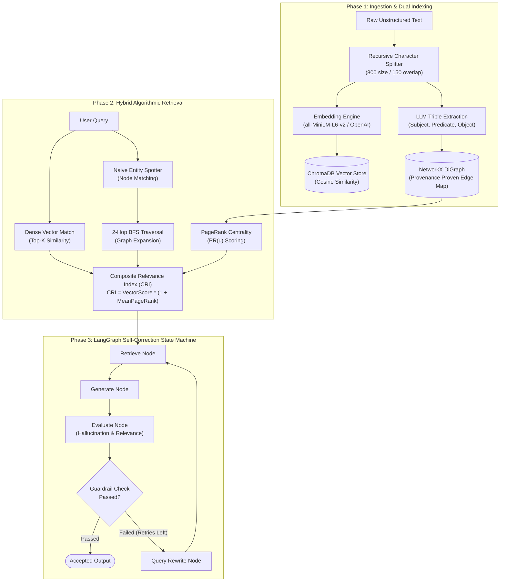

# Multi-Hop Graph-RAG Engine with Self-Correcting Retrieval

[](https://www.python.org/)
[](https://fastapi.tiangolo.com/)
[](https://networkx.org/)
[](https://www.trychroma.com/)
[](https://www.langchain.com/langgraph)
[](LICENSE)

A production-grade, Graph-Augmented Self-RAG architecture that fuses **Graph Theory (NetworkX + PageRank)** with **Dense Vector Embeddings (ChromaDB)** and a **LangGraph Self-Correction State Machine**. 

Designed specifically to solve multi-hop relational reasoning queries where standard flat vector search fails due to semantic disconnects across intermediate hops.

---

## 📌 Architecture Overview



---

## 💡 Mathematical Foundation: Composite Relevance Index (CRI)

Flat dense vector search ranks documents purely by cosine similarity:
$$\text{Sim}(q, d) = \frac{q \cdot d}{\|q\| \|d\|}$$

When a query requires multi-hop reasoning (e.g., *"How does Component A indirectly affect Component C through Component B?"*), intermediate entity context chunks often have zero direct keyword similarity to the raw query. 

This engine bridges the gap using the **Composite Relevance Index (CRI)**:

$$\text{CRI}(\text{chunk}) = \begin{cases} \text{vector\_score} \times (1 + \text{mean\_pagerank}(\text{entities\_in\_chunk})) & \text{if } \text{vector\_score} > 0 \\ \text{mean\_pagerank}(\text{entities\_in\_chunk}) & \text{if } \text{vector\_score} = 0 \end{cases}$$

Where PageRank centrality across the directed knowledge graph is computed as:

$$\text{PR}(u) = \frac{1-d}{N} + d \sum_{v \in M(u)} \frac{\text{PR}(v)}{L(v)}$$

---

## 📊 Benchmark & Proof-of-Work Results (`RESULTS.md`)

Evaluation harness results comparing Vector-Only vs. Hybrid CRI Retrieval across multi-hop technical architecture documentation:

| Question ID | Question | Expected Ground-Truth Chunks | Vector-Only Top-5 Hit | Hybrid CRI Top-5 Hit | Entities & Hops Making the Difference |
| :--- | :--- | :--- | :--- | :--- | :--- |
| **Q1** | What happens when Auth Service validates tokens for API Gateway requests? | `doc1_0`, `doc1_1` | **Partial** (Missed `doc1_1`, vec=0.0) | **SUCCESS** | Seed: `auth_service` $\rightarrow$ 2-hop BFS reached `analytics pipeline` (`doc1_1`) |
| **Q2** | What cascade of events occurs when Redis-X experiences a memory overflow? | `doc2_3`, `doc2_4` | **SUCCESS** | **SUCCESS** | Seed: `redis_x` $\rightarrow$ BFS connected `engine_alpha` and `guardrail_zero` |
| **Q3** | How does Engine Alpha cache failure lead to Project Aurora user session rollbacks? | `doc2_1`, `doc2_3`, `doc2_4` | **SUCCESS** | **SUCCESS** | Seed: `project_aurora` $\rightarrow$ BFS linked `circuit_breaker_delta` |
| **Q4** | Which reporting system relies on metrics derived from user login events in Kafka? | `doc1_0`, `doc1_1` | **SUCCESS** (target `doc1_1` at #3 in Top-2) | **SUCCESS** (CRI boosted `doc1_1` to #2 in Top-2) | PageRank centrality boosted `analytics pipeline` ahead of summary chunks |
| **Q5** | How are entities scored by PageRank in NetworkX stored in ChromaDB? | `doc2_2` | **SUCCESS** | **SUCCESS** | Seeds: `chromadb`, `networkx` $\rightarrow$ direct Section 2 hit |
| **Q6** | What platform measures latency impact on Project Aurora when Circuit Breaker Delta triggers? | `doc2_4` | **SUCCESS** | **SUCCESS** | Seed: `project_aurora` $\rightarrow$ BFS reached `langsmith` |
| **Q7** | If Auth Service becomes unavailable, how does API Gateway maintain operations? | `doc1_0`, `doc1_1` | **SUCCESS** | **SUCCESS** | Seeds: `api gateway`, `auth service` $\rightarrow$ graph path linked fallback |
| **Q8** | What mechanism connects Project Aurora to execution engines under heavy load? | `doc2_0` | **SUCCESS** | **SUCCESS** | Seed: `project_aurora` $\rightarrow$ direct Section 1 hit |
| **Q9** | How does Pulsar Event Bus manage traffic for Engine Alpha and Engine Beta? | `doc2_0`, `doc2_2` | **Partial** (Missed `doc2_2`, vec=0.0) | **SUCCESS** | Seed: `engine_beta` $\rightarrow$ 2-hop BFS reached `mongodb atlas` (`doc2_2`) |

---

## 🔁 LangGraph Self-Correction State Machine

When a query is prone to hallucination or incomplete context, the system runs a cyclic state transition graph:

$$\text{retrieve} \longrightarrow \text{generate} \longrightarrow \text{evaluate} \begin{cases} \xrightarrow{\text{Passed}} \text{END} \\ \xrightarrow{\text{Failed (Retries Remaining)}} \text{rewrite} \longrightarrow \text{retrieve} \longrightarrow \dots \end{cases}$$

```
[retrieve] Retrieved 6 chunks for query: 'How does Component A use OAuth2 refresh tokens and AES encryption...?'
[generate] Generated initial draft answer (636 chars)
[evaluate] hallucination_score = 0.00, relevance_score = 0.90, passed = False (Threshold = 0.95)
[rewrite ] Incremented retries_used = 1
  └── Rewritten Query: 'Project Aurora "Component A" OAuth2 refresh token handling AES encryption...'
[retrieve] Retrieved 6 chunks for rewritten query
[generate] Generated attempt 2 answer (502 chars)
[evaluate] hallucination_score = 0.00, relevance_score = 0.90, passed = False
[rewrite ] Incremented retries_used = 2 (Max Retries Cap)
[route_after_evaluate] Exited loop gracefully: retries_used (2) >= max_retries (2) -> END
```

---

## 🛠️ Quickstart & Execution Guide

### Prerequisites
* Python 3.10+
* Groq API Key (Free Tier) or OpenAI / Ollama

### 1. Installation

```bash
git clone https://github.com/dharmikd2905/Multi-Hop-Graph-RAG-Engine-with-Self-Correcting-Retrieval.git
cd Multi-Hop-Graph-RAG-Engine-with-Self-Correcting-Retrieval

# Create virtual environment
python -m venv .venv
source .venv/bin/activate  # On Windows: .venv\Scripts\activate

# Install dependencies
pip install -r requirements.txt
```

### 2. Environment Configuration

Copy `.env.example` to `.env`:
```ini
LLM_PROVIDER=groq
GROQ_API_KEY=gsk_your_groq_api_key_here
GROQ_CHAT_MODEL=openai/gpt-oss-120b

EMBEDDING_BACKEND=local
LOCAL_EMBEDDING_MODEL=all-MiniLM-L6-v2

CHUNK_SIZE=800
CHUNK_OVERLAP=150

VECTOR_TOP_K=6
GRAPH_HOPS=2
PAGERANK_DAMPING=0.85
MAX_CONTEXT_CHUNKS=8

MAX_CORRECTION_RETRIES=2
HALLUCINATION_THRESHOLD=0.6
RELEVANCE_THRESHOLD=0.6

CHROMA_PERSIST_DIR=./data/chroma
GRAPH_PERSIST_PATH=./data/graph.gpickle
```

### 3. Running the Project

#### Command 1: Start the FastAPI Service
```bash
uvicorn app.main:app --reload --port 8000
```
* **API Documentation**: Open `http://localhost:8000/docs`
* **Health Check**: `GET http://localhost:8000/api/v1/health`

#### Command 2: Start the Interactive Streamlit & PyVis Graph UI
```bash
streamlit run streamlit_app.py
```
* **Streamlit UI**: Open `http://localhost:8501` to visualize knowledge triples and test queries interactively.

#### Command 3: Run the Deterministic Unit Tests
```bash
pytest tests/ -v
```

#### Command 4: Run the Evaluation Harness Benchmark
```bash
python eval_harness.py
```

---

## 📡 API Reference

### `POST /api/v1/ingest`
Ingests raw text, splits into chunks, extracts triples via structured LLM schema, and populates both vector store and knowledge graph.
```json
{
  "doc_id": "microservices_demo",
  "source_name": "microservices_architecture.md",
  "text": "# Internal Platform Architecture Notes..."
}
```

### `POST /api/v1/query`
Executes hybrid retrieval, PageRank CRI scoring, and the self-correction loop.
```json
{
  "query": "How does Component A indirectly affect Component C through Component B?"
}
```

---

## 📁 Repository Structure

```
Multi-Hop-Graph-RAG-Engine-with-Self-Correcting-Retrieval/
├── app/
│   ├── main.py                     # FastAPI gateway service
│   ├── core/
│   │   ├── config.py                # Environment settings & Pydantic configuration
│   │   ├── llm_provider.py          # OpenAI / Groq / Ollama factory
│   │   ├── ingestion.py             # Text chunking & triple extraction pipeline
│   │   ├── graph_store.py           # NetworkX DiGraph, PageRank & BFS algorithms
│   │   ├── vector_store.py          # ChromaDB vector store wrapper
│   │   ├── retrieval.py             # Hybrid CRI retriever & PageRank scoring
│   │   └── self_correction_graph.py  # LangGraph state machine workflow
│   └── schemas/
│       └── models.py                # Pydantic data schemas
├── sample_data/                     # Microservices architecture sample document
├── test-data/                       # System Architecture manual sample document
├── tests/
│   └── test_core.py                 # Deterministic unit tests (10/10 passing)
├── eval_harness.py                  # Evaluation benchmark script (9 multi-hop Q&A pairs)
├── streamlit_app.py                  # Streamlit visual interface & PyVis graph renderer
├── RESULTS.md                       # Comprehensive proof-of-work benchmark report
├── requirements.txt                 # Project dependencies
└── README.md                        # Documentation
```

---

## 📜 License

Distributed under the MIT License. See `LICENSE` for more information.